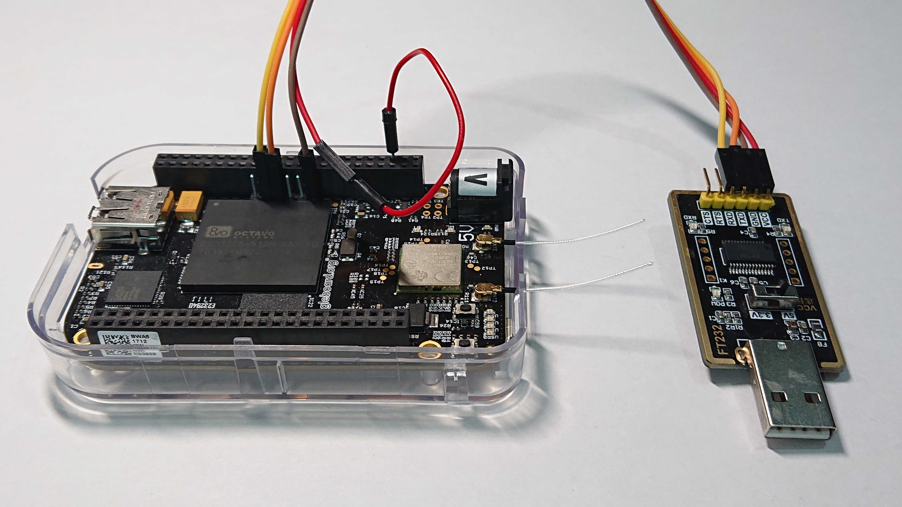

# BeagleBoot

Simple bootable image for BeagleBoard.

The purpose of this repository is to showcase the principles and the construction process of the bootable image.
While it may be used as a starting point, it is mere tutorial and not meant for any kind of production environment.

## Prerequisites

The toolchains for bare-metal ARM as well as Linux ARM are required:
```
apt install build-essential flex bison libelf-dev lzop
apt install gcc-multilib gcc-arm-none-eabi binutils-arm-none-eabi libnewlib-arm-none-eabi
apt install gcc-arm-linux-gnueabi binutils-arm-linux-gnueabi
```

## Build & Install

*Initialise git submodules*: This is needed to get the sources of the third-party repositories, which bring in the
sources of the essential parts that make up the bootable image (U-Boot, Linux kernel, BusyBox).
```
$ git submodule update --init
```

*Build U-Boot*: Builds Secondary Program Loader as well as the U-Boot image.
```
$ ./make-uboot.sh
```

*Build Linux kernel*: Builds the kernel image for the BeagleBone Black Wireless using the official default
  configuration.
```
$ ./make-kernel.sh
```

*Build BusyBox*: Builds the stub of the root file-system using BusyBox.
```
$ ./make-busybox.sh
```

*Build image*: Builds the bootable SD-Card image. Requires `sudo` permissions to be able to use loop devices.
```
$ ./make-image.sh
```

*Write image*: Writes the bootable image to the SD-Card. Replace the `mmcblk0` by the device representing the SD-Card
you want to write to. Note that this will discard all information stored on the SD-Card and overwrites them with the
image, you have been warned.
```
# blkdiscard -fv /dev/mmcblk0
# dd if=build/sdcard.img of=/dev/mmcblk0 bs=4M status=progress && sync
```

*Boot*: Boots the BeagleBoard from the SD-Card created in the previous steps
- Insert the SD-Card to the slot on the BeagleBone Black Wireless.
- Connect the UART0 using pin-out shown on the image below (the red wire is for powering the BeagleBoard via the
  usb-to-serial adapter and is optional).
- Hold the user-button (the single button just next to the `P8` header, close to the SD-Card slot; left bottom side of
  the board as shown on the image below, the button itself obscured by the header) while powering-up the board.
- Connect to the serial console:
  ```
  $ screen /dev/ttyUSB0 115200
  ```


*Enjoy!*: The U-Boot gives 4 seconds before loading the Linux kernel. If the space-bar is hit during this delay, the
U-Boot will start the console instead. Otherwise, the Linux kernel is loaded and the basic system is booted. The `root`
user will be logged-in automatically and the shell will be started once the boot process is finished.

## Contents

- `src`
  - `uEnv.txt`: environment for U-Boot
    - [uEnv-min.txt](./src/uEnv-min.txt): minimal configuration (default)
    - [uEnv-bbb.txt](./src/uEnv-bbb.txt): configuration file from official image (not used)
    - [uEnv-def.txt](./src/uEnv-def.txt): configuration file from official image (not used)
    - [uEnv-nfs.txt](./src/uEnv-nfs.txt): configuration file from official image (not used)
  - [init](./src/init): simple init
  - [fstab](./src/fstab): `/etc/fstab` configuration file, defines mounts for `/proc` `/sysfs` and `/boot`
  - [hostname](./src/hostname): `/etc/hostname` configuration file
  - [passwd](./src/passwd): `/etc/passwd` configuration file, defines `root` user

- `data`
  - [rootfs_embedjournal.tar.xz](./data/rootfs_embedjournal.tar.xz): The `rootfs` provided by the [EmbedJournal tutorial](https://embedjournal.com/kernel-compilation-beaglebone-black/) downloaded from [here](https://www.dropbox.com/s/k93doprl261hwn2/rootfs.tar.xz?dl=0). (not used)

## References

The folowing resources has been used to create this demonstration. It is highly recommended to review these resources
for much more additional details:
- [Embedded Linux Booting Process](https://www.youtube.com/watch?v=DV5S_ZSdK0s)
- [Open IOT Summit: Rob Landley: Building the Simplest Possible Linux System](https://www.youtube.com/watch?v=Sk9TatW9ino)
- [Hello World for bare metal ARM using QEMU](https://balau82.wordpress.com/2010/02/28/hello-world-for-bare-metal-arm-using-qemu/)
- [Embed Journal: Compiling and Deploying BeagleBone Black Kernel](https://embedjournal.com/kernel-compilation-beaglebone-black/)
- [Embed Journal: Compiling and Deploying BeagleBone Black Kernel](https://embedjournal.com/custom-rfs-beaglebone-black/)


